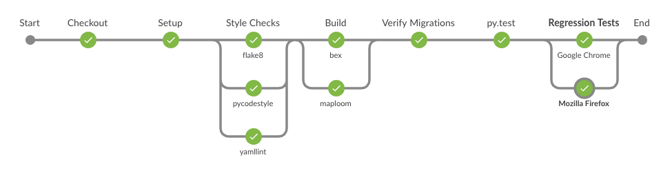

## Boundless Exchange Pipeline

Boundless Exchange uses the Jenkins Multibranch Pipeline, which creates a set of Pipeline projects according to 
detected branches in one SCM repository. The Jenkins master instance does not run any jobs, instead, it spins up 
temporary instances based on an Amazon Machine Image (AMI). The AMI includes docker, docker-compose and git cli 
(with ssh credentials). This method was used to save money and also to allow for all stages to easily be run on a 
new Jenkins server.
### Jenkins Job Configuration

The configuration of the Pipeline is pretty basic with only two areas:

1. **Branch Sources - Github**
    + Credentials: boundlessgeoadmin (Jenkins Global credential - Username with password)
    + Owner: boundlessgeo
    + Repository: exchange
    + Behaviors:
        + Discover branches: Exclude branches that are also filed as PRs
        + Discover pull requests from origin: Merging the pull request with the current target branch revision
        + Discover the pull request with the current target branch revision: Contributors
    + Property strategy: All branches get the same properties


2. **Build Configuration**
    + Mode: by Jenkinsfile
        + Script Path: Jenkinsfile

**Note:** _Below is the location of the configuration on Jenkins instance._

```bash
$ pwd
/var/lib/jenkins/jobs/Exchange
$ ls
branches  config.xml  indexing  state.xml
```

### Jenkinsfile

The [Jenkinsfile](https://github.com/boundlessgeo/exchange/blob/master/Jenkinsfile) is what Jenkins will process as 
the pipeline, it consists of multiple stages.



1. **Checkout**

    This stage consists of git checkout of the exchange repository (private), 
    [submodules](https://github.com/boundlessgeo/exchange/blob/master/.gitmodules) and 
    [exchange-mobile-extension](https://github.com/boundlessgeo/exchange-mobile-extension) (private).
    
2. **Setup**

    This stage sets up the temporary host by pulling a key image, ensuring docker-compose environment
     is cleaned up by shutting down any existing networks, clearing images and volumes.
  
3. **Style Checks**

   This stage runs parallel jobs for various style checks.
   + pycodestyle
   + yamlint
   + flake8


4. **Build**

   This stage runs parallel jobs for building maploom and docker images.
   + maploom
   + `docker-compose up --build --force-recreate`


5. **Verify Migrations**

   This stage verifies that any new django migrations that were added were added to the pull request.

6. **py.test**

   This stage runs py.test against all tests in exchange, coverage is also provided during this step.
   
7. **Regression Tests**

   This stage runs parallel jobs for regression tests using the included 
   [katalon project](docker/qa/README.md). The parallel jobs test the following browser types:
   + Mozilla Firefox
   + Google Chrome

8. **SonarQube Analysis**

   This stage runs runs static code analysis using SonarQube. It will run scans for both exchange and 
   geonode source code. Due to limited features on the community SonarQube, this stage only runs on the 
   master branch.

9. **Update Connect Docs**

   This stage uploads the documentation to Boundless Connect. This stage only runs on the master branch 
   and if the commit was a tag.
   
10. **Deploy**

   **TODO**: this stage should trigger a chef update of the new code if the branch is master.

### Shared Libraries

The Exchange pipeline uses a [global shared library](https://github.com/boundlessgeo/bex-pipelib) 
for a few global variables:
+ bashDocker
+ gitTagCheck
+ katalonDocker


### EC2 Instances being utilized

**Jenkins Community Edition**
+ endpoint: https://ciapi.boundlessgeo.io
+ amazon account: suite-dev
+ instance id: i-0530c6f2a165bf041
+ instance type:  t2.medium

**SonarQube Community Edition**
+ endpoint: https://sonar-ciapi.boundlessgeo.io
+ amazon account: suite-dev
+ instance id: i-0fc762524e650f49d
+ instance type: t2.large

### Jenkins Cloud Amazon EC2 AMIs

**ciapi-slave-docker**
+ AMI ID: ami-09d08b6bbe58e12db
+ Instance Type: T2Xlarge
